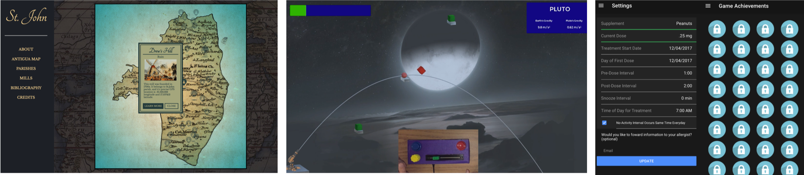

<link rel="stylesheet" href="cspui.css">

# CSCI 479: Computer Science Design Project
After 3 years at Bucknell, you've gained an extraordinary amount of technical knowledge. This is your opportunity to own a larger scale project from top to bottom. But more importantly, it's an opportunity to figure out a design process that you'll need for years after graduation. To that end, you will complete a semester-long project for an external client while applying and reflecting on software engineering processes.  

- **Who:** [Prof. Evan Peck](https://evanpeck.github.io/) \| [How to meet with me](https://evanpeck.github.io/student-faq/#can-we-meet)
- **Where and When:** There are 2 sections of this course. 
  - `DANA 117, MWF 1-1:50pm`
  - `BRKI 166, MWF 2-2:50pm`

## >> Quick Links
- [Syllabus](docs/syllabus)
- [Google Classroom Link](https://classroom.google.com/u/1/c/NTM3NjkwMjIwMzU4)
- [Classroom and Discord invites](https://moodle.bucknell.edu/course/view.php?id=47293)

## >> 🧑🧑🧑 Team Milestones
📣 Team Milestones should be committed to your repository in a `reports` folder as well as in the appropriate submission space in Google Classroom. Teams will be assigned at the start of the 3rd week of class. 
{: .notice .notice-blue}

- [Team Processes Overview](prompts/team_processes) \| _9.07_
- [System Design Paper](docs/system) \| Overview: _9.14_ \| Report: _9.23_
- [1st Progress Report](docs/progress) \| _10.19_
- [2nd Progress Report](docs/progress) \| _11.07_
- Final Report and Presentation \| _12.02 & 12.05_

## >> 🧑 Individual Milestones
📣 Individual work should be submitted via Google Classroom. Links and content will appear below as each date approaches and we progress through the semester 
{: .notice .notice-blue}

- Individual Prompts (all deadlines are at 9am):
  - 8.24: What do we want to get out of this course? _See Google Classroom_
  - 8.26: [Rapid-fire assessment](prompts/project_assess)
  - 8.29: [How do we form a good team?](prompts/teamcreation)
  - 9.02: [How do we ensure a healthy, productive team?](prompts/processes)
  - 9.30: [How do we make sure we're not making the world worse?](prompts/ethics)
  - _Upcoming topics: technical writing, ethics & social impact, code reviewing_

  <!-- - 8.26: [Rapid-fire assessment](prompts/projectassess)
  - 8.29: [How do we form a good team?](prompts/teamcreation)
  - 9.02: [How do we ensure a healthy, productive team?](prompts/processes)
  - 10.26: [How do we make sure we're not making the world worse?](prompts/ethics)
  - 11.09: _How do we ensure quality in our projects?_ -->

<!--   
- [Final (Individual) Reflection](docs/reflection) \| _End of finals period_ -->

## >> 🗓️ Schedule
📣 Due to the open nature of this course, a large chunk of the semester is intentionally left a bit ambiguous. This is to allow us the option to align content and timelines better with clients and projects. The major deadlines above will hold. 
{: .notice .notice-blue}

<iframe src="https://docs.google.com/spreadsheets/d/e/2PACX-1vT3YZYNHB0UfEEfzZsw-h7HYV2c8Cw7ssXUXovTQZWTtYrKFzgr6bIYlKF8yN6K7sbm2JTUhm1gzbh_/pubhtml?gid=263478748&amp;single=true&amp;widget=false&amp;headers=false&amp;range=a1:f47&amp;chrome=false" style="width:100%;height:550px;"></iframe>
